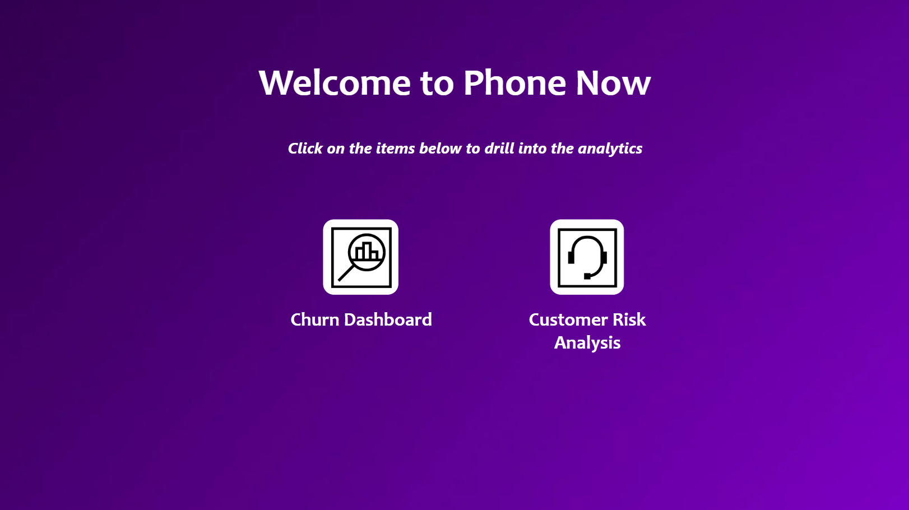

<h2 align="center">PwC Project</h2>

<h3 align="center">Call Center Solution</h3>

<a href="https://app.powerbi.com/view?r=eyJrIjoiYzVkNWQ2NjEtMDg3OS00MGY0LThjODItNGE3ZWM5NTRhZGEwIiwidCI6ImMyOTMyNDU1LWIzZTctNDJhYi1hY2ExLWZhNTNmMjcxN2EyNSJ9">Link to Interactive Dashboard</a>

In this data analytics project, I leveraged Microsoft Power BI to delve into the operational metrics of a call center, aiming to enhance its overall performance and customer satisfaction. The project focused on key performance indicators (KPIs) such as Average Speed of Answer, Number of Calls per Month, Average Satisfaction Rating, and the Percentage of Answered and Resolved Calls.

1. Average Speed of Answer

2. Number of Calls per Month

3. Average Satisfaction Rating

4. Answered and Resolved Calls

<h3 align="center">Customer Retention</h3>

<a href="https://app.powerbi.com/view?r=eyJrIjoiZGFkOTRlNjItZjU3My00ZDk3LThhM2EtZmRmMzkxOTE3YTFhIiwidCI6ImMyOTMyNDU1LWIzZTctNDJhYi1hY2ExLWZhNTNmMjcxN2EyNSJ9">Link to Interactive Dashboard</a>

Aimed to provide a comprehensive view of customer churn within a business. By analyzing key factors such as demographics, customer account information, subscribed services, and payment methods, the project sought to identify patterns and insights that could contribute to a proactive customer retention strategy.

1. Demographics

2. Customer Account Information

3. Services Subscribed

4. Churn by Type of Internet Service

5. Customers by Internet Service

6. Type of Contract and Years of Contract

7. Sum of Monthly Charges

8. Churn by Payment Method

